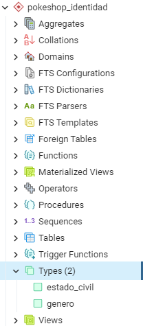

# pokeshop-backend-identidad
 ### Microservicio de Identidad

# Manera local
### Dependencias
■ Descargar e instalar el proyecto: https://github.com/NyoByte/nyobyte-backend-utils de la rama **develop**.

■ Descargar e instalar el proyecto: https://github.com/NyoByte/pokeshop-backend-entity-identidad de la rama **develop**.

### Acceso a la Base de Datos
■ Servidor en **5432**

■ Crear rol con nombre: **pokeuser** y clave: **pokeuser**

■ Crear base de datos con nombre: **PokeshopDB** y asociado al rol creado.

■ Crear un schema dentro de la db con nombre: **pokeshop_identidad** y asociado al rol creado.

### Crear tablas y registros

■ Crear Enum estado_civil y genero:

 
  en _*estado_civil*_ debe ver: *S*, *C*, *D* y *V*

  en _*genero*_ debe ver: *M*, *F* y *S*

■ Descomentar el archivo **PokeshopIdentidadRunner**

■ _Correr el proyecto_

### Mantener el proyecto
■ Comentar el archivo anterior **PokeshopIdentidadRunner**

■ Cambiar el _spring.jpa.hibernate.ddl-auto=_**create-drop** del *_application.properties_*